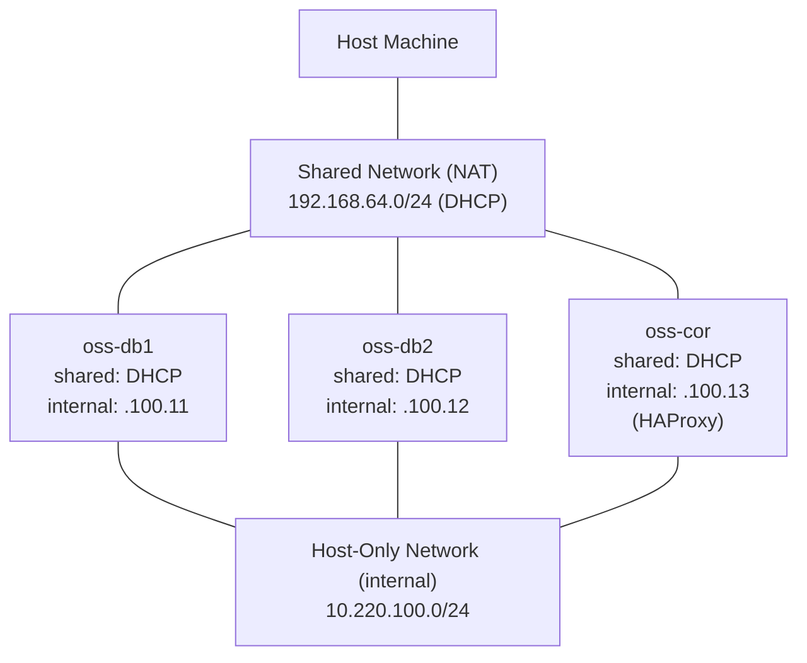

# postgresql-ha-cluster

## 1. Overview

This repository contains the **Ansible-based automated provisioning playbook** for a **High-Availability PostgreSQL cluster** running on Rocky Linux 9 virtual machines.

The target stack is **Patroni + etcd + HAProxy**: Patroni manages PostgreSQL replication and failover, an etcd cluster (with the coordinator host providing the 3rd quorum member) handles leader election, and HAProxy routes client connections to the active primary using Patroni's REST health-check API so clients always reach the writable node. The coordinator host additionally runs **PMM** (Percona Monitoring and Management — an open-source observability stack) to collect PostgreSQL and Patroni metrics.

## 2. Network Architecture

Each VM is connected to two networks: a **Shared** network for host access and internet, and a **Host-Only** network (`internal`) for cluster traffic (replication, Patroni, etcd).



### 2.1 Subnet Allocation

| Network | Type | CIDR | IP Assignment | Purpose |
|---------|------|------|---------------|---------|
| shared | Shared | 192.168.64.0/24 | DHCP | Host SSH access, internet |
| internal | Host-Only | 10.220.100.0/24 | Static | Cluster traffic (Patroni / etcd / replication) |

Clients reach the writable node through **HAProxy on `oss-cor` (`.100.13`)**, which routes connections to the active primary via Patroni's REST health-check API — no floating VIP is used.

## 3. Host Inventory

| Group | Hostname | Shared (DHCP) | Host-Only (10.220.100.*) | Role                                            |
|-------|----------|---------------|--------------------------|-------------------------------------------------|
| db    | oss-db1  | DHCP          | .100.11                  | PostgreSQL primary                              |
| db    | oss-db2  | DHCP          | .100.12                  | PostgreSQL standby                              |
| —     | oss-cor  | DHCP          | .100.13                  | HAProxy + PMM monitoring + 3rd etcd quorum member |

`oss-cor` sits outside the `db` group so plays can target `hosts: all` for cluster-wide work (etcd, common setup), `hosts: db` for PostgreSQL-specific work, and `hosts: oss-cor` for monitoring.

## 4. Prerequisites

### 4.1 Network Configuration (Manual)

Before executing any automated provisioning, each VM **must** have its network interfaces and SSH port configured manually according to Section 2.

Refer to: [`docs/vm-network-setup.md`](docs/vm-network-setup.md)

### 4.2 Control Host Preparation

Install the required runtime dependencies on the control host (the workstation running `ansible-playbook`):

```bash
python3 -m venv .venv
source .venv/bin/activate
pip install -r requirements.txt
```

`sshpass` is also required because `ansible.cfg` enables `ask_pass`. Install it via your platform's package manager (e.g. `brew install sshpass` on macOS, `dnf install sshpass` on RHEL-family).

### 4.3 Ansible Collection Dependencies

```bash
ansible-galaxy collection install -r requirements.yml
```

Collections install into `./collection/` per `ansible.cfg` (`collections_path = ./collection`) and are git-ignored.

## 5. Execution Procedures

TBU

## 6. License

This project is licensed under the [MIT License](LICENSE).
